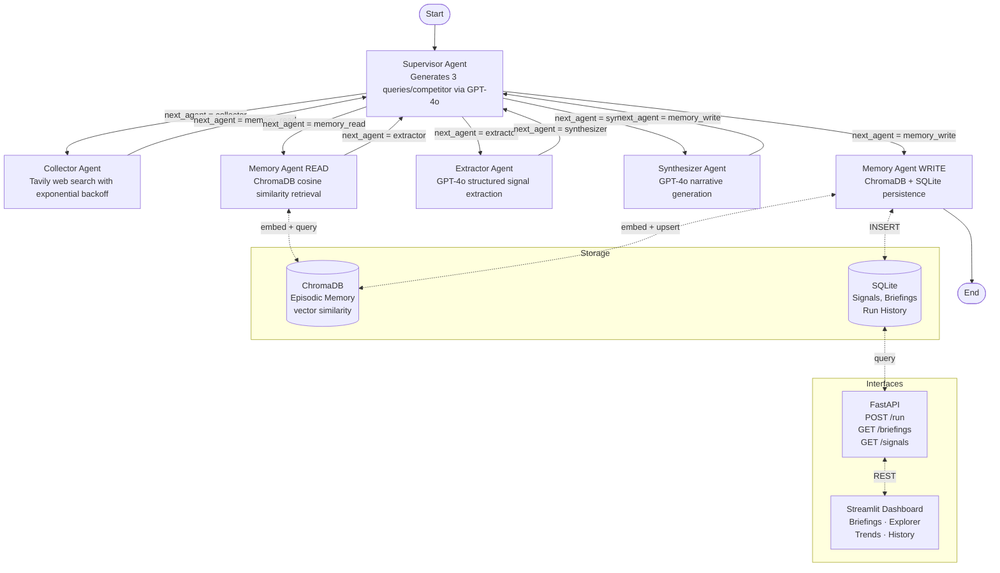

# CompeteIQ


**CompeteIQ** is a production-grade multi-agent competitive intelligence pipeline built with LangGraph. It automatically monitors AI competitors (Anthropic, Google, Meta, Mistral, Perplexity), extracts structured intelligence signals from live web sources via Tavily, synthesizes findings into a formatted weekly briefing, and persists everything to ChromaDB and SQLite so each run compounds on prior knowledge.

The system is designed to operate autonomously on a weekly schedule via GitHub Actions, with a FastAPI REST layer for programmatic access and a Streamlit dashboard for human-readable exploration of signals and trends. Every component follows production engineering standards: typed interfaces, structured logging, graceful error handling, and a full pytest suite with mocked external dependencies.

## Architecture



## Quick Start

```bash
# 1. Clone
git clone https://github.com/your-username/competeiq.git
cd competeiq

# 2. Install dependencies
pip install -r requirements.txt

# 3. Configure environment
cp .env.example .env
# Edit .env and fill in OPENAI_API_KEY and TAVILY_API_KEY

# 4. Run the pipeline
python main.py

# Optional: override competitors
python main.py --competitors Anthropic Google OpenAI
```

### Start the API server

```bash
uvicorn api.main:app --host 0.0.0.0 --port 8000 --reload
# Docs at http://localhost:8000/docs
```

### Start the Streamlit dashboard

```bash
streamlit run dashboard/app.py
# Opens at http://localhost:8501
```

### Docker Compose (API + Dashboard)

```bash
docker-compose up --build
# API:       http://localhost:8000
# Dashboard: http://localhost:8501
```

## Sample Output

```markdown
## CompeteIQ Weekly Intelligence Briefing

**Run Date:** April 21, 2025
**Run ID:** `a3f9c2d1-...`
**Competitors Monitored:** Anthropic, Google, Meta, Mistral, Perplexity
**Signals Detected:** 8

---

### Executive Summary

Anthropic's Claude 4 launch marks a significant step-change in long-context
reasoning benchmarks, directly challenging GPT-4o on enterprise use cases.
Google's Gemini 2.0 pricing revision signals an aggressive commoditisation
strategy, while Meta's new Llama 4 open-weight release continues to compress
margins across the industry.

---

### Key Developments by Competitor

#### Anthropic
- **Product Launch**: Claude 4 Released with 1M Token Context — Anthropic launched
  Claude 4 with a 1-million token context window, outperforming competitors on
  long-document tasks. [Impact: 🔴 HIGH]

#### Google
- **Pricing Change**: Gemini 2.0 Flash API Price Cut 40% — Google reduced Gemini
  2.0 Flash input pricing from $0.075 to $0.04 per 1M tokens, targeting
  cost-sensitive enterprise customers. [Impact: 🔴 HIGH]

#### Meta
- **Research Release**: Llama 4 Scout Open-Weight Model — Meta released Llama 4
  Scout (17B active parameters, 109B total) under a permissive licence, enabling
  fine-tuning without inference cost. [Impact: 🟡 MEDIUM]

---

### Strategic Implications

- Claude 4's context window advantage creates a near-term moat for document
  intelligence workloads — OpenAI must respond within 1–2 quarters.
- Google's price war signals confidence in infrastructure cost reductions;
  margins across the sector will compress further in H2 2025.
- Open-weight Llama 4 accelerates enterprise self-hosting, reducing dependency
  on API providers and commoditising base-model capability.
- Perplexity's vertical search expansion into enterprise could erode Bing
  Copilot market share faster than Microsoft anticipated.
- Mistral's partnership with major EU cloud providers suggests a regulatory-
  arbitrage positioning strategy for GDPR-sensitive verticals.

---

### Signals to Watch

- Anthropic enterprise pricing announcement expected Q3 2025 — could reshape
  Claude 4 adoption trajectory.
- Google's potential Gemini integration into Workspace Premium tiers — watch
  for bundling announcements at Google I/O.
- Meta's Llama 4 fine-tuning ecosystem: if major cloud providers offer managed
  fine-tuning, it could become the de-facto open standard.
```

## API Reference

| Endpoint | Method | Description | Example Response |
|---|---|---|---|
| `/run` | POST | Trigger pipeline run (async) | `{"run_id": "uuid", "status": "started"}` |
| `/briefings` | GET | List recent briefings (`?limit=10`) | `[{"run_id": "...", "signal_count": 8, ...}]` |
| `/briefings/{run_id}` | GET | Get specific briefing | `{"run_id": "...", "content": "## CompeteIQ..."}` |
| `/signals` | GET | List signals (`?competitor=&signal_type=&limit=`) | `[{"competitor": "Anthropic", ...}]` |
| `/runs` | GET | Pipeline run history (`?limit=50`) | `[{"run_id": "...", "signal_count": 8, ...}]` |
| `/health` | GET | System health check | `{"status": "healthy", "db_accessible": true}` |

Interactive docs: `http://localhost:8000/docs`

## Project Structure

```
competeiq/
├── .github/
│   └── workflows/
│       ├── ci.yml          # pytest on every push
│       └── weekly.yml      # pipeline every Monday 9am UTC
├── agents/
│   ├── supervisor.py       # routes tasks, generates queries
│   ├── collector.py        # Tavily web search
│   ├── extractor.py        # GPT-4o structured extraction
│   ├── synthesizer.py      # GPT-4o briefing generation
│   └── memory_agent.py     # ChromaDB read/write
├── memory/
│   ├── episodic.py         # ChromaDB vector store
│   └── semantic.py         # SQLite knowledge base
├── models/
│   └── schemas.py          # Pydantic models + AgentState
├── tools/
│   ├── search.py           # Tavily wrapper with retry
│   └── formatter.py        # Briefing markdown formatter
├── api/
│   └── main.py             # FastAPI REST API
├── dashboard/
│   └── app.py              # Streamlit dashboard
├── tests/
│   ├── test_agents.py
│   ├── test_memory.py
│   └── test_api.py
├── main.py                 # LangGraph pipeline + CLI entry point
├── requirements.txt
├── docker-compose.yml
└── .env.example
```

## Tech Stack

| Component | Technology |
|---|---|
| Agent orchestration | LangGraph 0.2+ (StateGraph, MemorySaver) |
| LLM | OpenAI GPT-4o / GPT-4o-mini |
| Web search | Tavily API |
| Vector memory | ChromaDB (cosine similarity) |
| Structured storage | SQLite via SQLAlchemy 2.0 |
| Data validation | Pydantic v2 |
| REST API | FastAPI 0.115+ |
| Dashboard | Streamlit 1.38+ |
| CI/CD | GitHub Actions |
| Containerisation | Docker + Compose |

## Running Tests

```bash
pytest tests/ -v --cov=. --cov-report=term-missing
```

Tests use mocked OpenAI and Tavily clients — no API keys required to run the test suite.

## Environment Variables

| Variable | Required | Default | Description |
|---|---|---|---|
| `OPENAI_API_KEY` | Yes | — | OpenAI API key |
| `TAVILY_API_KEY` | Yes | — | Tavily search API key |
| `OPENAI_MODEL` | No | `gpt-4o-mini` | Model to use for LLM calls |
| `CHROMA_PERSIST_DIR` | No | `./data/chroma` | ChromaDB persistence directory |
| `SQLITE_DB_PATH` | No | `./data/competeiq.db` | SQLite database path |
| `DEFAULT_COMPETITORS` | No | `Anthropic,Google,Meta,Mistral,Perplexity` | Comma-separated competitor list |
| `LOG_LEVEL` | No | `INFO` | Python logging level |
| `API_BASE_URL` | No | `http://localhost:8000` | Dashboard → API base URL |
